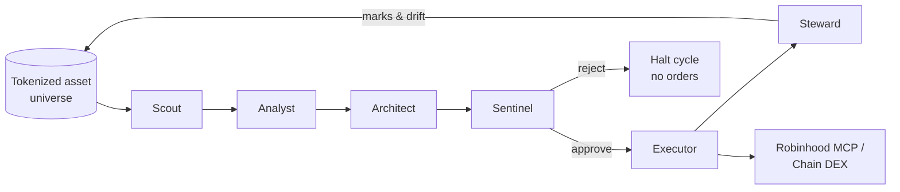

<div align="center">


# STURNA — the autonomous private-markets desk

**A swarm of six AI agents that sources, scores, constructs, risk-checks, executes and monitors a basket of tokenized private-market & real-world assets on [Robinhood Chain](https://docs.robinhood.com/chain/).**

[](https://github.com/tylerbroqs/sturna/actions/workflows/ci.yml)
[](LICENSE)
[](https://www.typescriptlang.org/)
[](CONTRIBUTING.md)
[](#going-live-on-robinhood-mcp)

</div>

---

Sturna is a fully-functioning reference implementation of a multi-agent investment desk: the agents make real decisions, the portfolio is constructed and rebalanced with real constraints and risk math, and the desk streams its reasoning to a production-grade dashboard. It runs in **paper mode** out of the box (deterministic simulated fills, no capital at risk) and is **MCP-ready** — flip to live by wiring credentials to Robinhood's official [agentic trading MCP](https://robinhood.com/us/en/agentic-trading/).

> **Disclaimer** — Marks, valuations and on-chain metrics are simulated for a paper book. This project is for research and education. Nothing here is investment advice.

## The swarm

The agents run as a handoff pipeline — each owns exactly one decision:

| Agent | Role | What it does |
|-------|------|--------------|
| **Scout** | Sourcing | Ingests the on-chain universe; enforces custody, liquidity & token-maturity gates. |
| **Analyst** | Research | Scores every asset on a five-factor model (growth / quality / momentum / liquidity / thesis-fit). |
| **Architect** | Construction | Conviction-weighting with a volatility penalty; per-name & sector caps; RWA ballast floor. |
| **Sentinel** | Risk | Independent circuit-breaker — concentration, HHI, weighted vol, 1-day 95% VaR. Can halt a cycle. |
| **Executor** | Execution | Diffs target vs. book, routes minimal-turnover orders via Robinhood MCP / Chain DEX. |
| **Steward** | Monitoring | Marks the book to market between cycles and flags drift beyond tolerance. |



## Architecture

```
src/core/          the agent engine (framework-free TypeScript)
  agents/          scout · analyst · architect · sentinel · executor · steward
  mcp/             RobinhoodAdapter — paper + mcp-live venues
  universe.ts      tokenized private/RWA asset universe (seeded GBM price paths)
  orchestrator.ts  runs one full swarm cycle, emits an event timeline
  engine.ts        long-lived state: basket, NAV curve, activity feed, metrics
src/server/        Hono API that runs the engine live + serves the web app
web/               Vite + React + Tailwind + Framer Motion dashboard
```

The core engine has **zero framework dependencies** — it runs identically in Node and in the browser, which is why the production dashboard can run the entire swarm client-side.

## Quickstart

```bash
# 1. backend (agent engine + API)
npm install
npm run server            # http://localhost:8787

# 2. frontend (in another shell)
cd web && npm install && npm run dev   # http://localhost:5173

# — or — build the web app and let the API serve it on a single port:
cd web && npm run build && cd .. && npm run start   # http://localhost:8787
```

Quick terminal smoke test of the swarm (no server needed):

```bash
npm run cycle
```

## Deploy (Vercel / any static host)

The dashboard runs the **entire agent swarm in the browser**, so the production
site is a pure static SPA — no server, no serverless state to manage.

- **Vercel** — the included `vercel.json` builds `web/` and serves `web/dist`.
  Import the repo and deploy; no configuration needed. (Equivalently, set the
  project's *Root Directory* to `web` and Vercel auto-detects Vite.)
- **Netlify / GitHub Pages / Cloudflare Pages** — build command
  `npm --prefix web install && npm --prefix web run build`, publish dir
  `web/dist`.

The `src/server` Hono API is **optional** — only needed if you want a
server-side engine (shared state across clients, or a place to wire live MCP
execution). It is not used by the static deploy.

## Going live on Robinhood MCP

The `RobinhoodAdapter` targets Robinhood's official agentic surface:

- **Trading MCP** — `https://agent.robinhood.com/mcp/trading`
- **Banking MCP** — `https://agent.robinhood.com/mcp/banking`

To route real orders: activate a Robinhood Agentic Account, set `RH_MCP_TOKEN`,
switch the engine mode to `mcp-live`, and implement the MCP client call in
`src/core/mcp/robinhoodAdapter.ts` (`executeLive`). It's a config + one
integration point — the rest of the swarm is unchanged.

## API

| Endpoint | Description |
|----------|-------------|
| `GET /api/overview` | Metrics, mandate, agents, risk, adapter status |
| `GET /api/basket` | Live basket & positions |
| `GET /api/nav` | NAV curve vs. benchmark |
| `GET /api/activity` | Agent reasoning stream |
| `GET /api/universe` | Tokenized asset universe |
| `POST /api/run-cycle` | Run one full swarm cycle |
| `POST /api/mandate` | Switch mandate & re-run |

## Contributing

Contributions are welcome — new agents, risk models, alternative venues, dashboard polish. Start with [CONTRIBUTING.md](CONTRIBUTING.md), and note the [Code of Conduct](CODE_OF_CONDUCT.md). Good first areas:

- **Risk models** — extend `sentinel.ts` (expected shortfall, stress scenarios, correlation clusters)
- **Factor research** — new signals in `analyst.ts`
- **Venues** — additional execution adapters alongside `RobinhoodAdapter`
- **Universe** — richer simulated asset dynamics in `universe.ts`

## License

[MIT](LICENSE) © Sturna contributors
